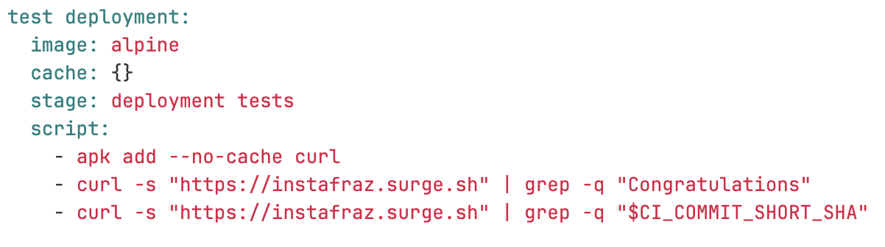
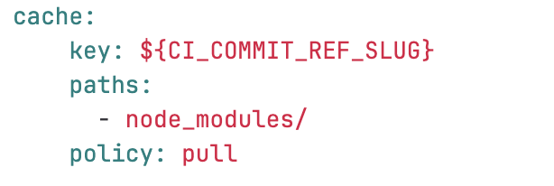

# Static Website Project - Using Caches to Optimise Build Speed

We can use caches to hold onto files we may need later e.g. dependencies, so time is not wasted redownloading them.

Caches can also make jobs fail, try clearing caches.

## Cache vs. Artifacts

Artifacts: Output of build tool, passess between stages
Caches: Not used to store build results, temporary storage for dependencies

# 8. Cache

1. Add cache with a key and paths globally (not inside a job). - can be made non global to speed it up.
   - cache: path to what we want to save 
   - key: environment variable (key to the current branch)

2. The first time you run it, it will fail early on as the files have not been created yet

3. The second time you run it the time taken to execute will be slightly shorter
4. To descrease the time further disable the cache for jobs that do not need it (to reduce the overhead of downloading and uploading the caches they don't need)
   - test artifact
   - deploy to surge
   - test deployment
5. add "cache: {}" to these jobs

5. To increase speed even further include a cache policy to only pull(download cache) not push (update the cache), as the cache remains the same.

6. Just incase your cache may need to be updated at some point we can add a job that updates (pushes) the cache...?