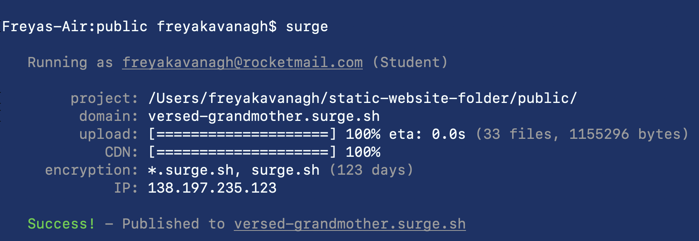

# Deployment using surge.sh

- Surge.sh is a cloud platform for serverless deployments
- ideal for static websites

## Steps

1. Go to terminal and install surge in your website's public file: npm install --global surge
2. run surge: surge
3. sign up/log in with emil and password
4. enter for project
5. enter for domain (can be changed later)

6. Visit the URl to view the website

