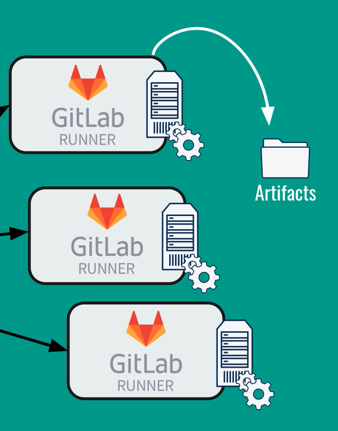

# Gitlab Architecture

## Gitlab Server

- Repository creation
- Manage projects
- Everything is saved in a database
- Delegates pipelines to the GitLab runner
  - Manages the process but doesn't do the steps

## GitLab Runner

- Runs the pipeline commands
- You can have as many runners as needed
  - can scale up or down
- Uses an image e.g. ruby:2.5