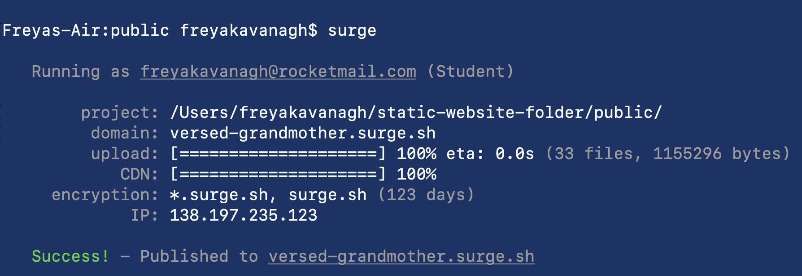
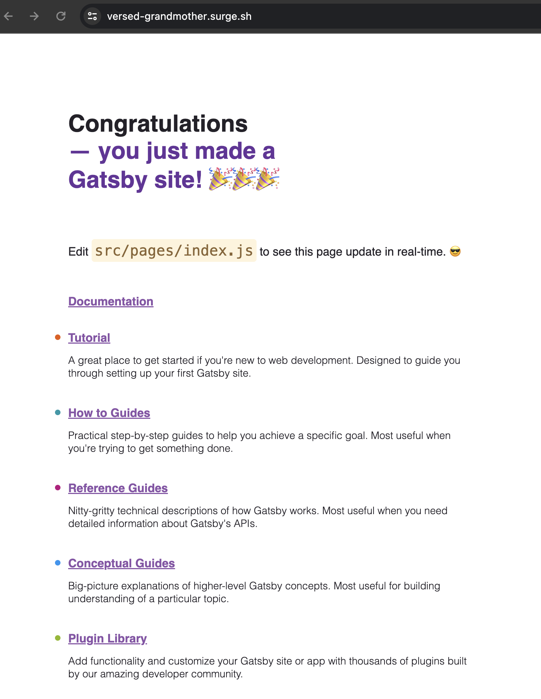
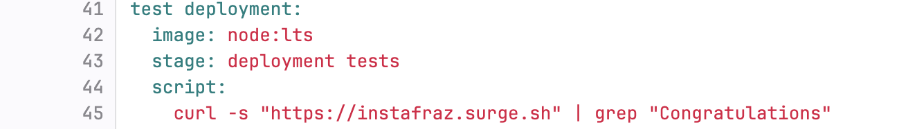

# Static Website Project 

1. Use gastby to create a website
2. Create Git lab repo and push changes

# 1. Manual Build Step

- A production build step where the code is processed further so it can be deployed (production ready code)
- i.e. gatsby build
- cd public
- ls
- You can view the artifact for this project (everything to build the project)

# 2. Pipeline

1. Need to change the image to one with node and npm
2. Create a new file in the project repo
3. Name it .gitlab-ci.yml
4. Create the build step

5. Create artifacts from ./public
6. Create the test stage by cheking if commands have failes (1-255) or passed (0)
   - one test that should pass
   - one test that should fail
7. Run the code

8. Remove the fail test after checking
9. Add a quiet flag to the pass test so it doesn't write the large output of data
10. Change the test job image to alpine (much smaller and therefore faster)
11. Add a test website part to the test stage to view the website
    - serve: creates a server
    - &: runs the command in the bcakground, releasingthe terminal for the next command
    - sleep: to wait for the server to start
    - curl; downloads the contents of the website  
    - the pipe (|) gives the command before as input to the next command
    - tac: reads the input page and reverses the line order (hence why we run it twice)

12. The two test jobs will run in parallel
    - In some cases, running tests in parallel makes them faster (not in this case)

# 3. Deployment using surge.sh

- Surge.sh is a cloud platform for serverless deployments
- Ideal for static websites

## Steps

1. Go to terminal and install surge in your website's public file: npm install --global surge
2. Run surge: surge
3. Sign up/log in with emil and password
4. Enter for project
5. Enter for domain (can be changed later)

6. Visit the URl to view the website

7. Create a surge token in the terminal: surge token
8. Go to your GitLab project
9. Settings
10. CI/CD
11. Variables (these become environment variables used by surge)
12. Expand
13. Add variable

14. add another variable
    - add the token generated in te value box  

# 4. Deployment using surge.sh & Gitlab CI

1. Go back to the pipeline file on Gitlab
2. Create a new stage: deploy

1. Run the pipeline
   

4. Use the URL you chose

TIP: You can also change the default image for all stages by putting the command at the top of the script...
    - This can be changed for individual stages as per usual

# 5. Test Deployment

1. Add a new stage and job for deployment tests.

2. The job downloads the first page of the website and searches for the string "Congratulations"
   

3. Increase the speed by changing the image to alpine
4. Therefore we also have to add the curl command a alpine does not know it

