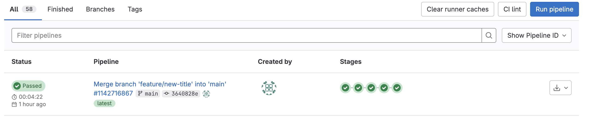

# YAML

YAML is a key value pair.<br>
It is similar to JSON.

- We can use it to store strings, integers, booleans, arrays (- or [])
- Indentation shows belonging i.e. John is a person
- Friends is a list of objects
- '#' to make a comment or comment out a command

### Example

```
Person:
    name: John
    age: 29
    isMale: true
    stuff:
        - laptop
        - car
        - bike
    food: [pizza, donuts, coke]
    friends:
      - name: Jane
        age: 19
      - name: Mike
        age: 22 
```
# Disabling Jobs

Use a full stop before the job title to disable the job.

```
.build website:
```

# Anchors

To anchor a value you use & and an alias.

If you need the self property to be the same as the name you could use an anchor...

```
Person:
    name: &name John
    age: 29
    isMale: true
    stuff:
        - laptop
        - car
        - bike
    food: [pizza, donuts, coke]
    friends:
      - name: Jane
        age: 19
      - name: Mike
        age: 22 
    self: *name
```
Self will also be John

You can also anchor objects...

```
base_place: &base
    city: nyc
    country: usa

Person:
    <<: *base
    name: &name John
    age: 29
    isMale: true
    stuff:
        - laptop
        - car
        - bike
    food: [pizza, donuts, coke]
    friends:
      - name: Jane
        age: 19
      - name: Mike
        age: 22 
    self: *name
```

Person will now have the properties city amd country.

In JSON... (using a YAML to JSON converter)

```

{
  "base_place": {
    "city": "nyc",
    "country": "usa"
  },
  "Person": {
    "city": "nyc",
    "country": "usa",
    "name": "John",
    "age": 29,
    "isMale": true,
    "stuff": [
      "laptop",
      "car",
      "bike"
    ],
    "food": [
      "pizza",
      "donuts",
      "coke"
    ],
    "friends": [
      {
        "name": "Jane",
        "age": 19
      },
      {
        "name": "Mike",
        "age": 22
      }
    ],
    "self": "John"
  }
}

```
# 14. Creating Job Templates

1. Create a template for deployment jobs
2. Disable it with a '.'
3. Similarities...
   - only
   - script
   - environment
4. Add local variables for the domain
5. Add the & and alias 
6. We can check the syntax with CI Lint on GitLab
   1. pipelines
   2. CI Lint

 