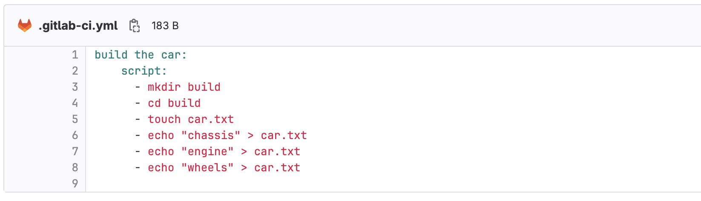
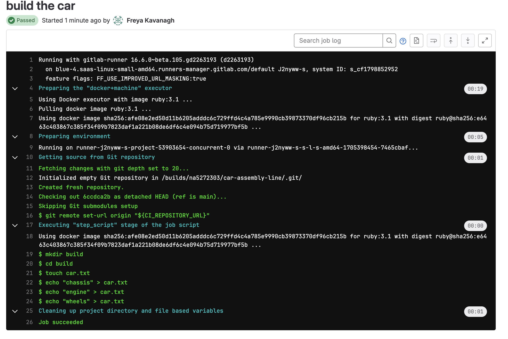
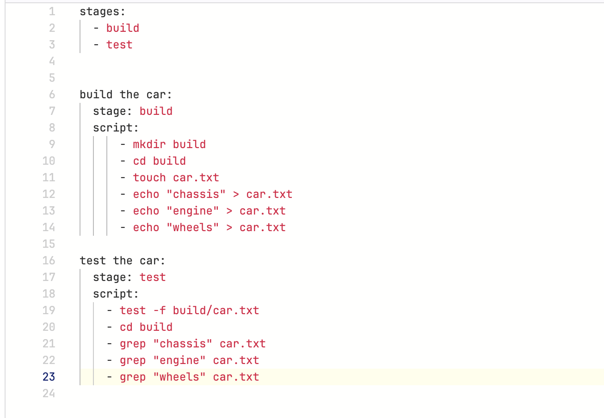
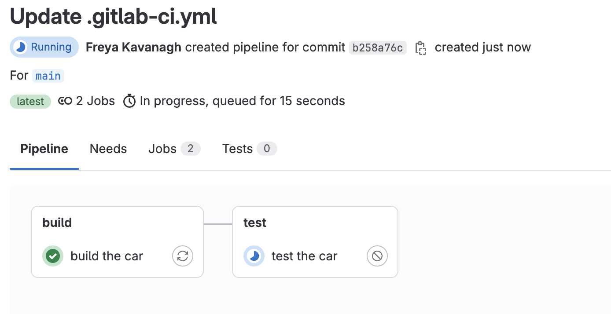
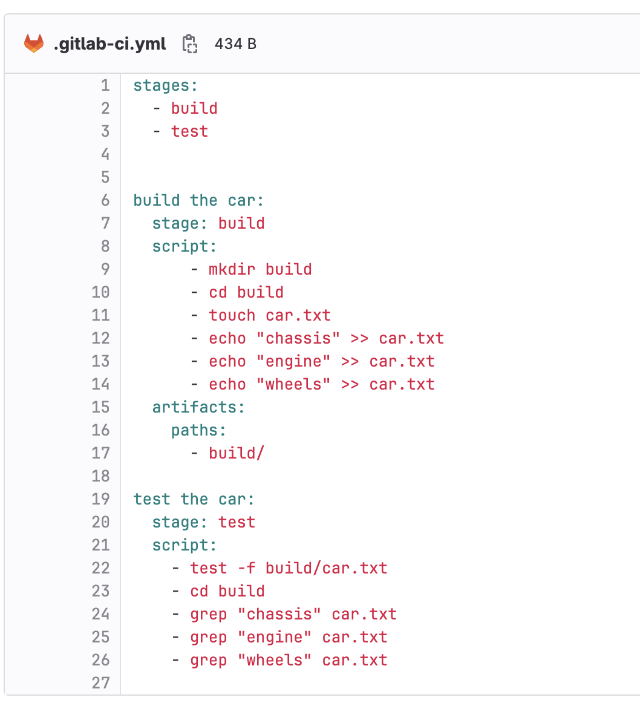
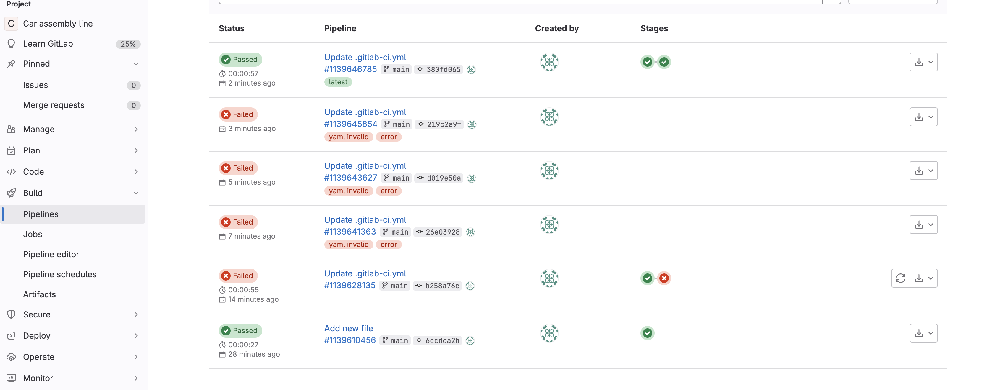

# Creating a pipeline on GitLab

1. Create new blank Project
2. New File
3. Name = .gitlab-ci.yml 
   - YAML is a data serialisation language used by Gitlab CI
   - the YAML file should be in the root of the project 
4. Start writing in the file
5. Use two spaces to define structure in the yaml file
6. Write shell commands

8. Commit changes
9. Go to pipeline to view the job being run by GitLab Runner

10. Add the testing stage of the script in the same file
11. test -f checks for a txt file
12. grep command searches a txt file for words
13. Define stages to specifiy the order of jobs
    - if not specified a job will be assigned to test stage  
    

1.  commit and check pipeline again to view the two jobs

15. The test-job failes because the jobs are not connected and so when job1 terminates all the files are destroyed so job2 can't find them.
16. We need to upload to an artifact repository
17. We also need to change > to >> so the text is appended rather than just replaced each time

18. you can also view all past pipelines

19. You can also view and download the artifacts created.