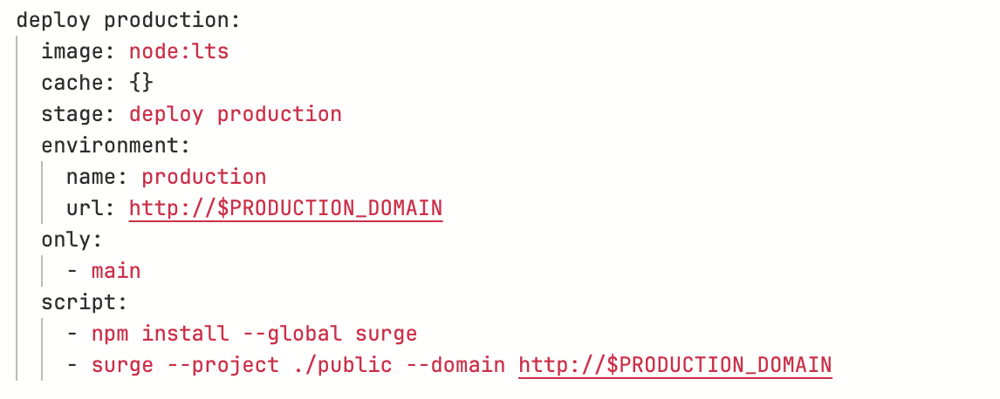
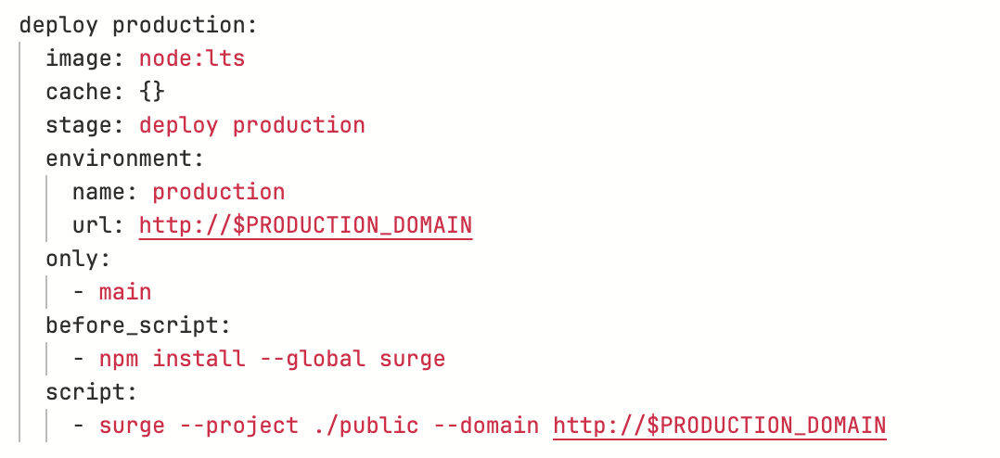

# Before_script and After_script

- Commands that are executed before or after the command in a script.
- Can be local or global.

## Before-script

- can be used to install dependencies rather than doing it in the script
- makes things easier to read

### VS.

## After_script

- not as commonly used