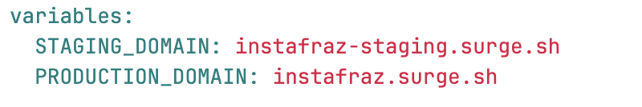

# Static Website Project - Creating Variables

# 10. Creating variables

Variables can be defined in a job or globally in the pipeline script. They reduce chance of error and make code simpler.

1. Add global variables for the staging and production url's.

2. Add these variable names to the script (remember to put '$' before the variable name)

