# Java Project

# 1. Build Stage

Compilation: changes cource code(.java) into Java bytecode(.jar) that can be executed on the Java Virtual Machine.

1. Create a .gitlab-ci.yml file in the repo
2. Create the build stage
3. Create the build job
4. Use the gradle wrapper build command to compile the application into a .jar file

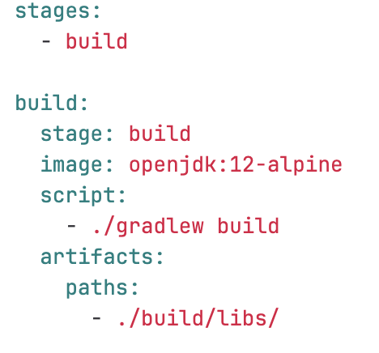

5. You can then browse the .jar file artifact

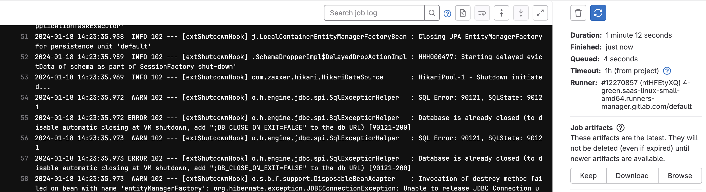

# 2. Smoke Test

To test if the application responds at all.

1. Create the test stage and the smoke test job.

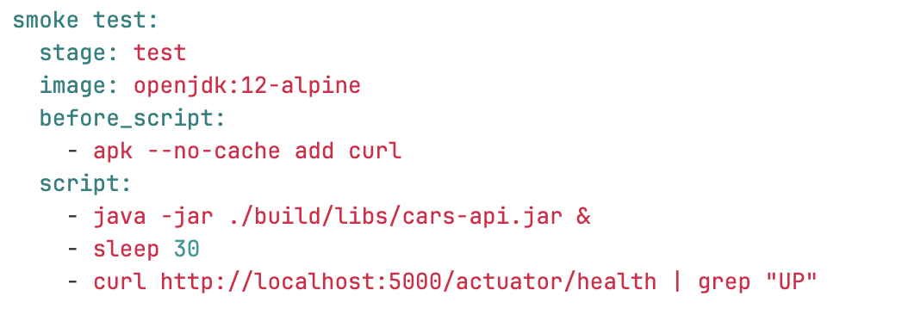

- Download the curl command in the before_script a the image does not have it.
- execute the .jar file.
- sleep for 30 seconds to let it finish running.
- Test the health of the application, healthy gives an "UP" response

# 3. Deploy Manually using AWS Elastic Beanstalk

AWS Elastic Beanstalk: A way to deploy software, serverless architecture
  - Serverless computing is a cloud computing execution model in which the cloud provider allocates machine resources on demand, taking care of the servers on behalf of their customers.

1. Change region to Ireland
2. Search for AWS Elastic Beanstalk
3. Create new application
4. Web server environment (the api works over HTTP)
5. Name the environment

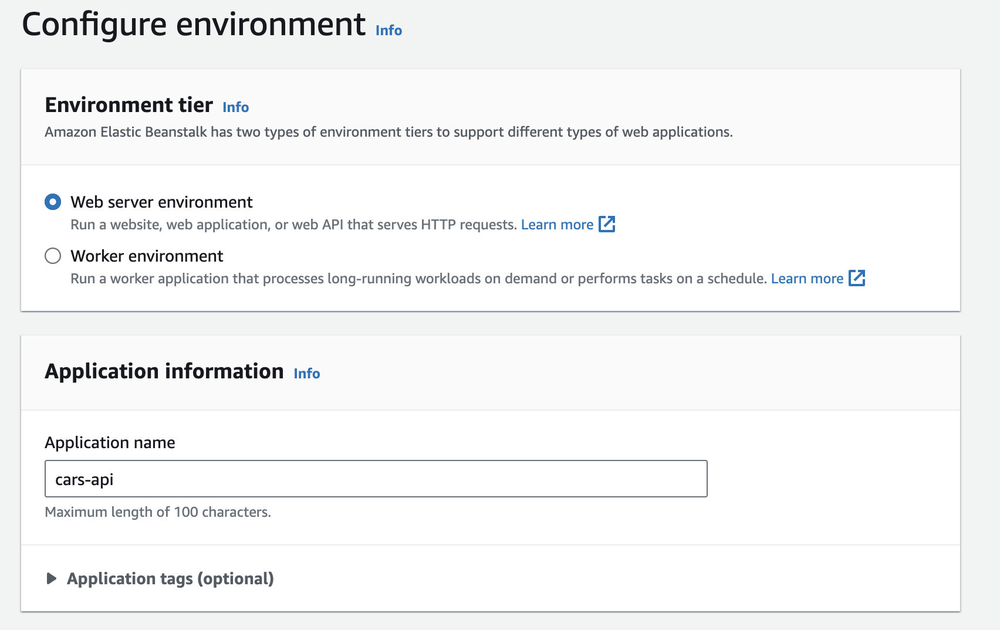

6. The domain will automaically generate
7. Platform: java
8. java 8 running on 64bit Amazon Linux

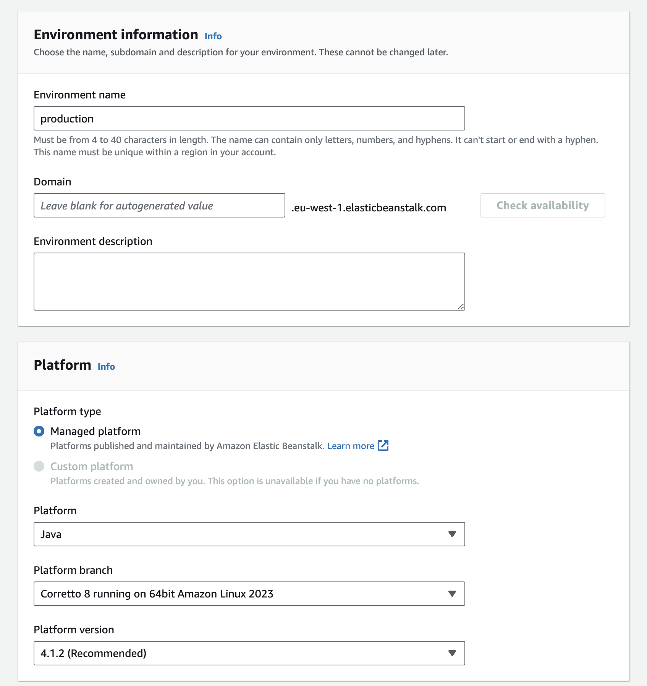

9.  Application code: Sample Application (to see how the environment works)
10. Single instance (free)
11. Next

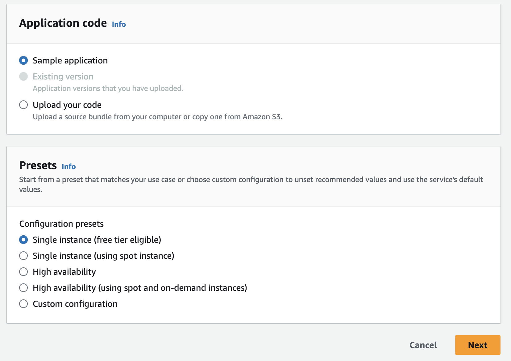

12. Created and use new service role.
13. Duplicate tab and search for IAM
14. Roles
15. Create role
16. AWS Service
17. EC2
18. Next
19. Search for beanstalk
20. MulticontainerDocker
21. WebTier
22. WorkerTier
23. Next

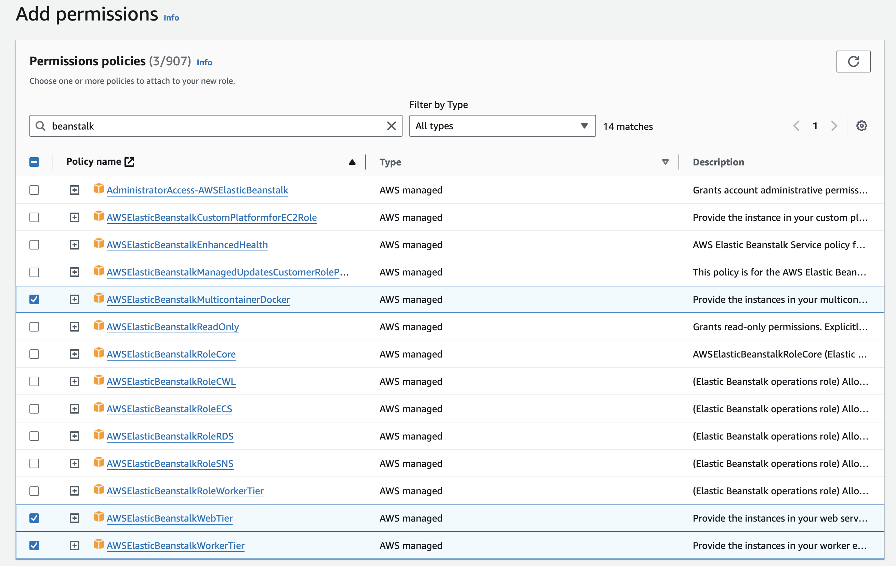

24. Name
25. Create role

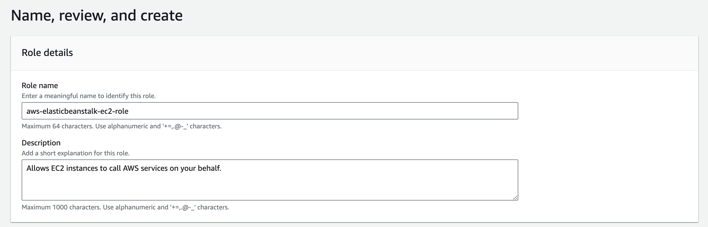

26. Refresh environment tab instance profile
27. Select EC2 Instance profile
28. Skip to review

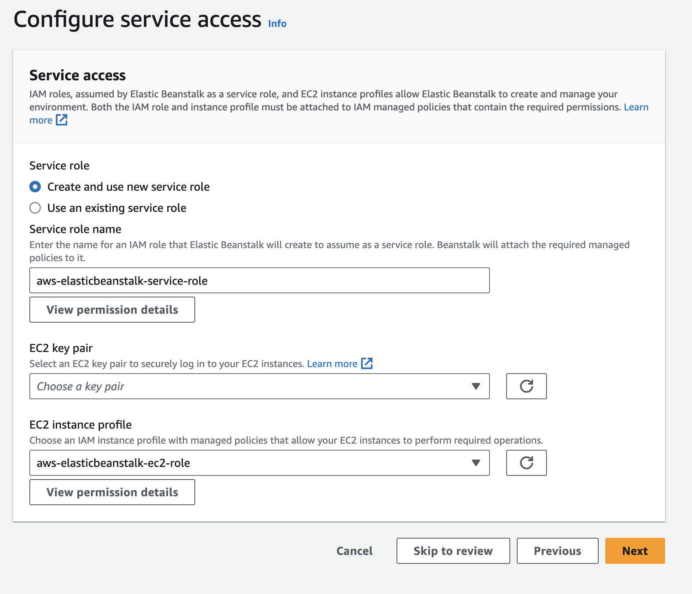

29. Submit
30. Wait for the environment to launch, then go to the Domain in 'environment overview'
31. You should see an elastic beanstalk website...

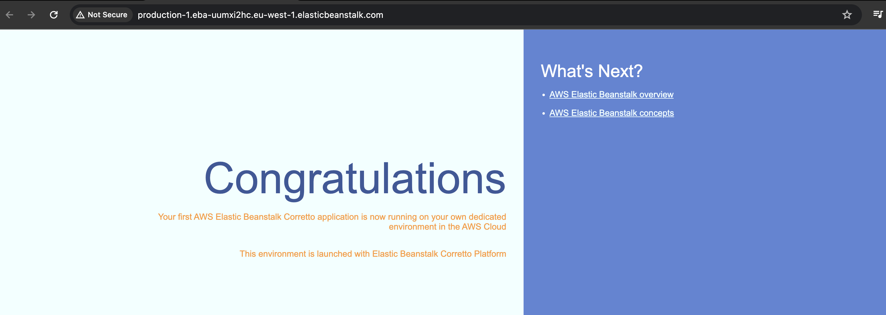

32. Upload and Deploy
33. Choose the .jar file
34. Deploy
35. Use PostMan to check the deployment...
36. Create a new environment with the URL created by elastic beanstalk

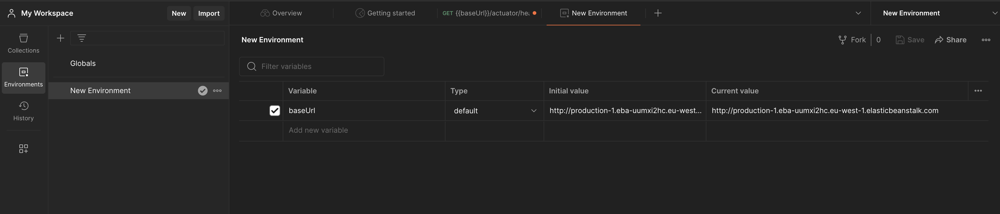

37. Check the health, you should get "up" as a result

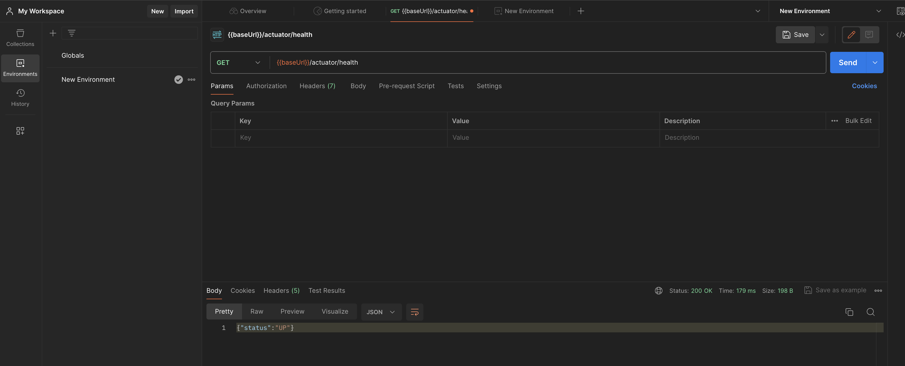

38. Check if it can do a get request for all cars

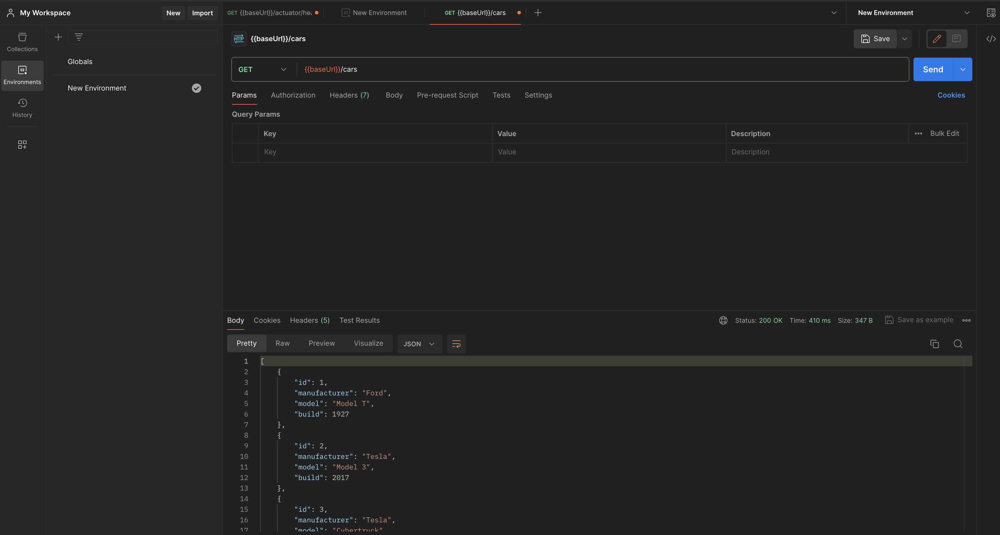

# 4. Deploy Automatically to AWS from GitLab CI

Use 'AWS Command Line Interface' to deploy from your command line interface automatically.
Use Amazon s3 to store the .jar file.

1. Go to s3
2. Create bucket.
3. Name
4. Leave all options as they are.
5. Create bucket
6. Go to GitLab
7. Settings
8. CI/CD
9. Variables
10. Add Variable for bucket name

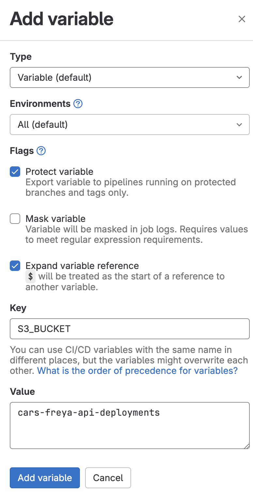

11. Go to IAM
12. Users
13. Create user...

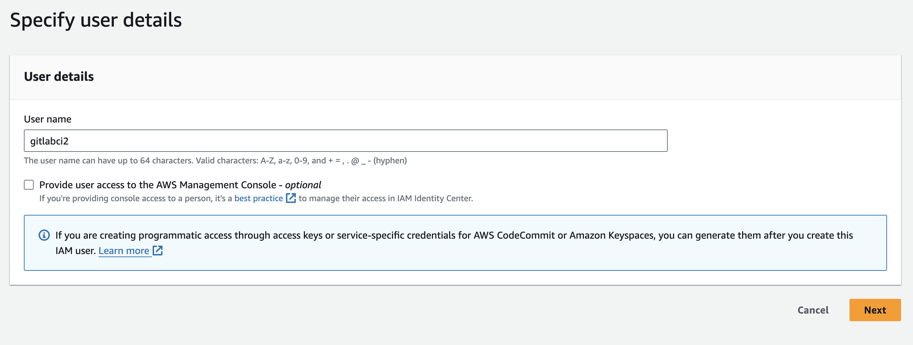

14. Add AmazonS3FullAccess
15. Next

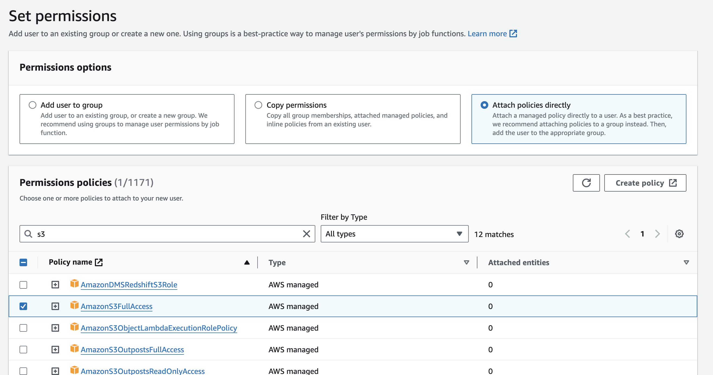

16. Create User
17. Go to user and security credentials
18. Create Access Key
19. Command Line Interface

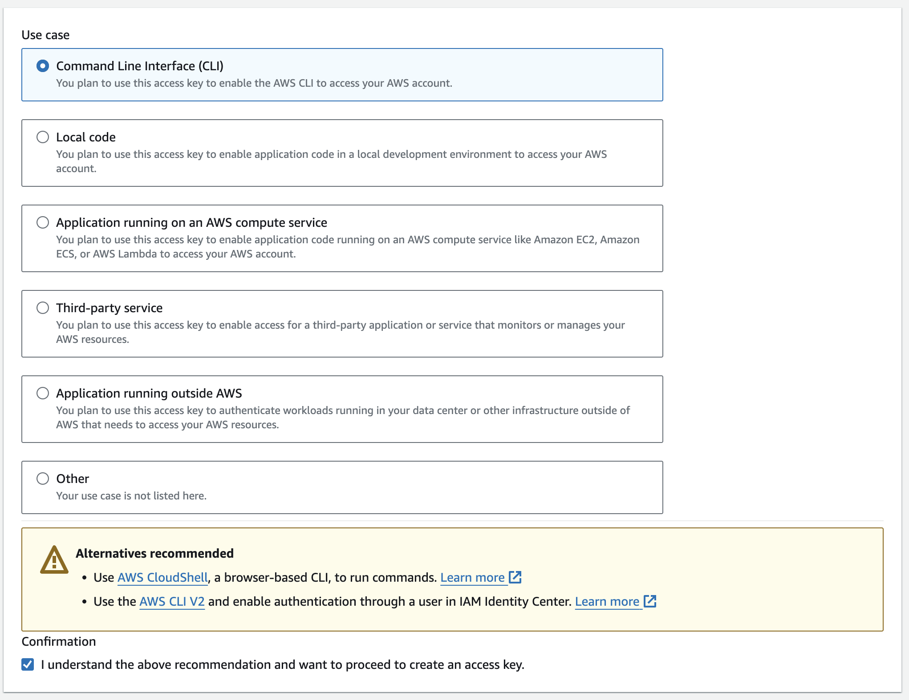

20. Download .csv
21. Create a CI/CD variable for access key and secret access key (using the correct aws names)

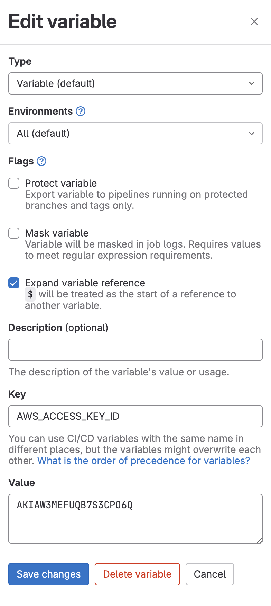

22.   Go to pipeline script
23.   Create a deploy stage and a deploy job
24.   In the script configure the instance and upload the .jar file to the bucket

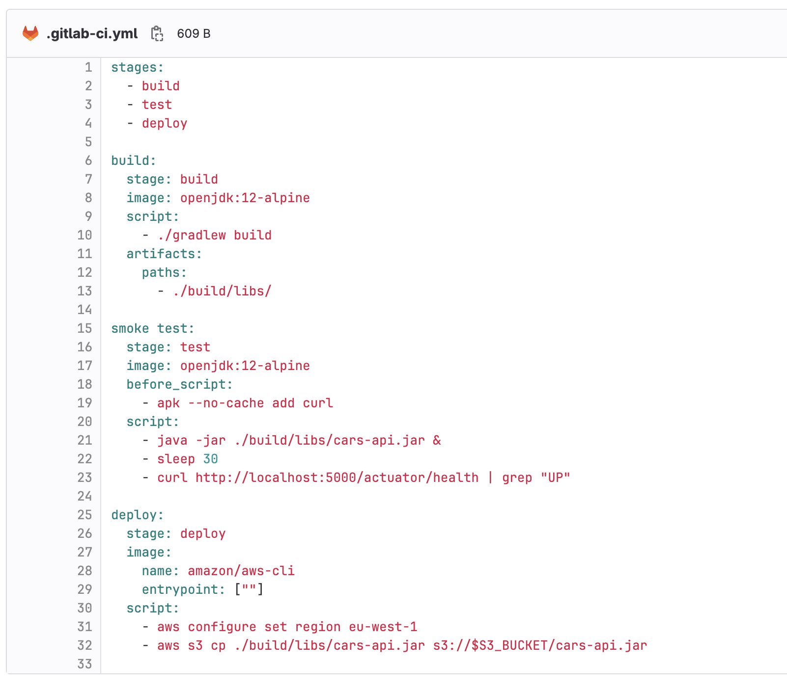

25. The pipeline should work
26. Check the s3 bucket contains the .jar file

## Script Variables

27. You can make the .jar file name a script variable
28. Use the environment variable '' that has a unique id for the current pipeline.
29. Insert the environment variable within the .jar file name to help you keep track of the current version (with -v for version before it)

30. We now have to create an application version in the script
31. In the same line we can also provide the application name as a variable
32. Also the version label which is the version environment variable
33. And the source bundle of te bucket and the key which is the artifact name as variables
34. Then add another command that deploys the version we just created.
35. Also add a command in the build script to rename the.jar file to the variable name we created
36. We then need to add beanstalk full permissions to our user... (we can now delete the old permission if we want to as they are included in this one)

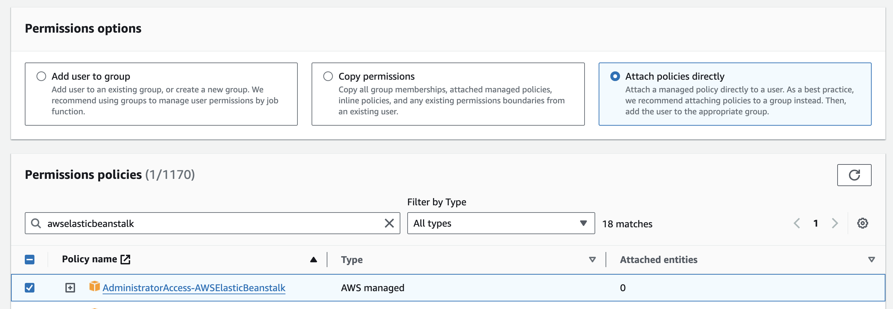

```
variables:
  ARTIFACT_NAME: cars-api-v$CI_PIPELINE_IID.jar
  APP_NAME: cars-api

stages:
  - build
  - test
  - deploy

build:
  stage: build
  image: openjdk:12-alpine
  script:     
    - ./gradlew build
    - mv ./build/libs/cars-api.jar ./build/libs/$ARTIFACT_NAME
  artifacts:
    paths:
      - ./build/libs/    

smoke test:
  stage: test 
  image: openjdk:12-alpine
  before_script:
    - apk --no-cache add curl
  script:
    - java -jar ./build/libs/$ARTIFACT_NAME &
    - sleep 30
    - curl http://localhost:5000/actuator/health | grep "UP"

deploy:
  stage: deploy
  image:
    name: amazon/aws-cli
    entrypoint: [""]
  script:
    - aws configure set region eu-west-1
    - aws s3 cp ./build/libs/$ARTIFACT_NAME s3://$S3_BUCKET/$ARTIFACT_NAME
    - aws elasticbeanstalk create-application-version --application-name $APP_NAME --version-label $CI_PIPELINE_IID --source-bundle S3Bucket=$S3_BUCKET,S3Key=$ARTIFACT_NAME
    - aws elasticbeanstalk update-environment --application-name $APP_NAME --environment-name "production-1" --version-label=$CI_PIPELINE_IID

```
### Keeping track of the app info

We want to replace these variables...

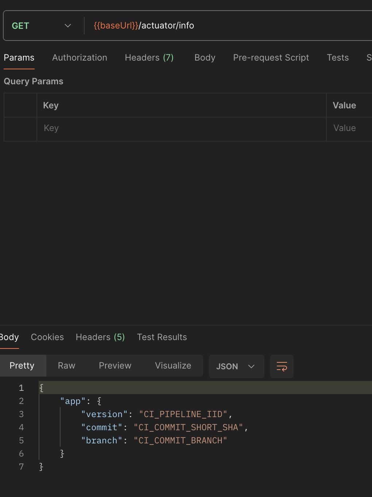

37. In the script use a sed command to replace the pipeline ID with an environment variable for the pipeline ID.
38. Do the same command two more times to replace the commit ID and the branch.
39. Run the pipeline
40. Check postman for the application info and it should have changed...

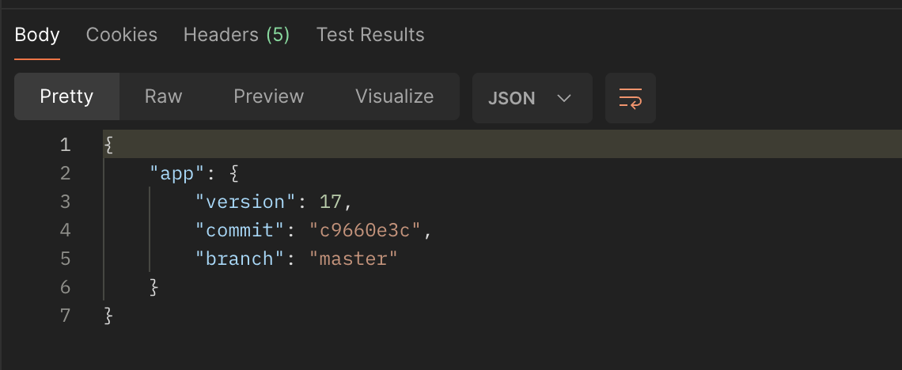

### Verifying Application version after deployment

41. First we need to find the domain name, we can find this in a JSON file of application info.
42. We need to parse the JSON file and extract the domain name from the CNAME property.
43. To extract the info from JSON we need to get the script to download jq in the before_script
44. Then pipe the info into jq and specifiy we are interested in CNAME.
45. Use curl commands and then grep to search for the pipeline ID and also UP in the health endpoint. (this command uses the CNAME variable)
46. Use a sleep command to give the command time to update environment before the curl commands 
    
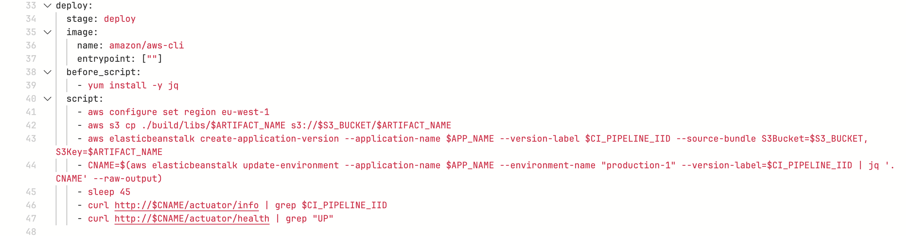

47. In the console log in the deploy job you will be able to find the info...

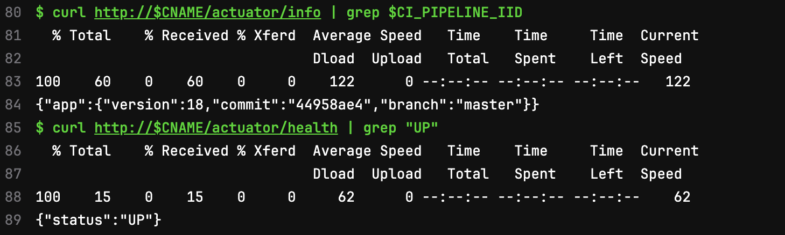

### Ensuring code standards and styles

Different tools can ensure the code respects a set of predefined standards. Some do a static analysis(just look at the code), others a dynamic code analysis(run the code to see how it behaves)

e.g. PMD

1.  PMD is already downloaded in the project (see vid to see it being used in intellij)
2.  To use PMD in the pipeline script add a command in the test stage
3.  Create a job called code quality.
4.  In the script use the command that allows pmd to test the code
5.  This wil generate a report, so we need to save this using artifacts.
6.  Usually when the job fails the artifacts won't be saved, but we need them!
7.  So we need to include a condition that tells it to always save the artifacts.

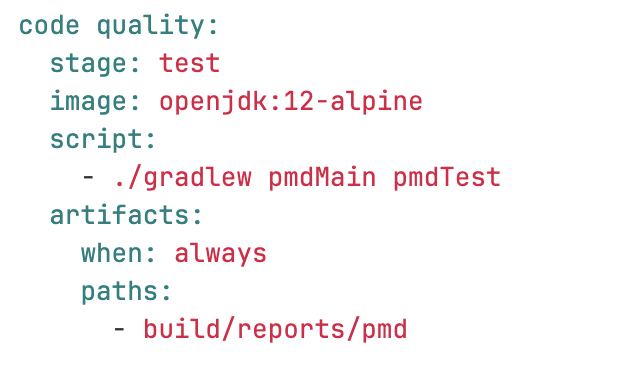

### Unit test stage

Unit tests test a unit of the code, for example a class.<br>
They have a short execution time and give instant feedback.<br>
Unit tests are allways at the bottom of the test pyramid.

average build year class.

1. Add a unit test job in test stage.
2. Script has a command that runs the test
3. Need artifact that saves the html test reports generated.
4. Another artifact for all the junit test reports.
5. Add a condition that wants the reports always.

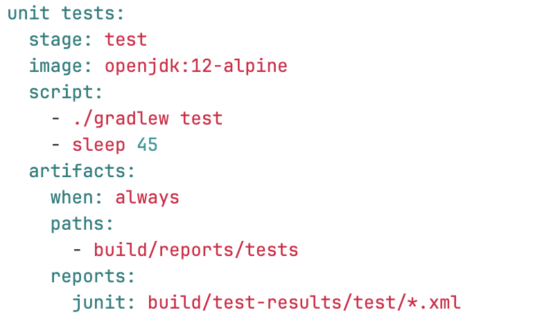

### API Tests

Ensures the API is working properly, and therefore the application is actually working.

1. Use postman to manually test endpoints e.g. /cars
2. Postman has a test tab that we can also use.
3. Save some searches in a collection e.g. health
4. Export the tests
5. Upload them into the project folder on gitlab
6. Also export the postman environment as a file
7. Put it in the root of the project on gitlab

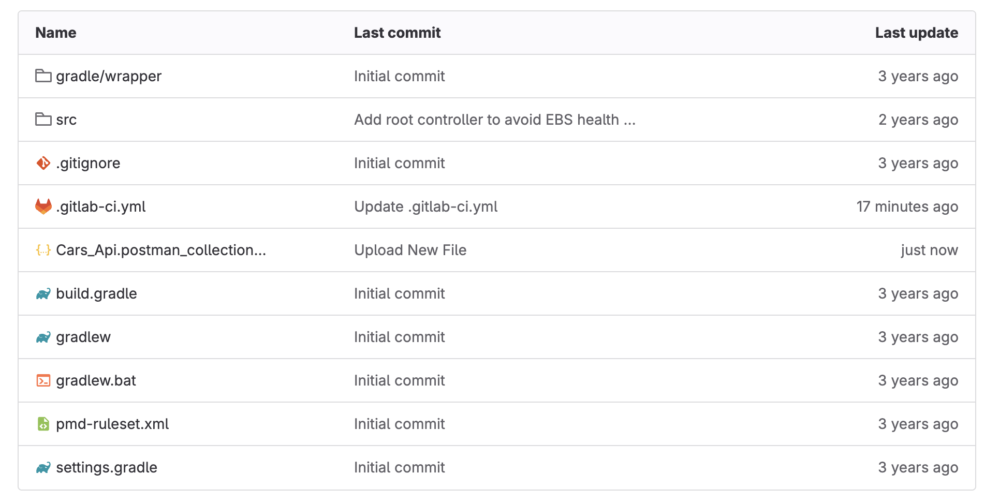

1. We need to use the postman companion tool, Newman CLI, to execute the collection tests.
2. Add a post deployment stage and api testing stage
3. Use a docker image that contains newman already.
4. In script
   - show the version of newman
   - run newman, specify the collection, environment and two reporters (e.g. htmlextra generatesva html report), then tell it where to export the reports
5. Use artifacts to save the reports always.

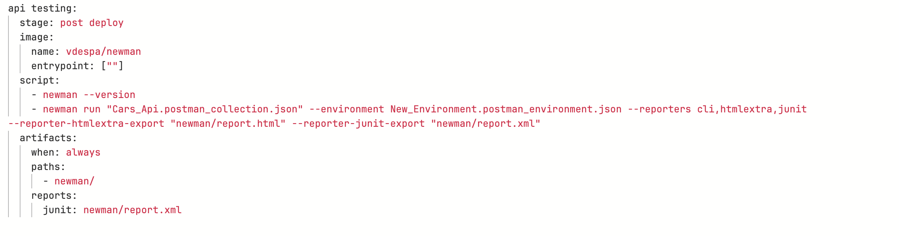

6. There should be a tests tab next to the pipeline tab that shows the tests that ran and how many passed

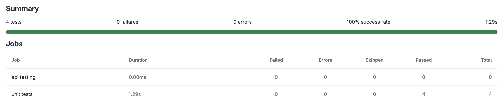

7. The report will be in artifacts

## Publishing HTML reports or dashboards

1. Add publishing stage and pages job
2. Make new folder called public that will hold all the html files we want to publish
3. Move report to folder
4. create a publishing artifact


5. After it has run, go to deploy, then pages
6. This will show you the address it will publish the pages at (may take 30 mins to be available)

