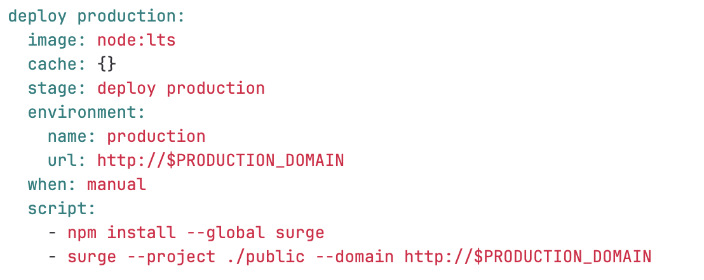
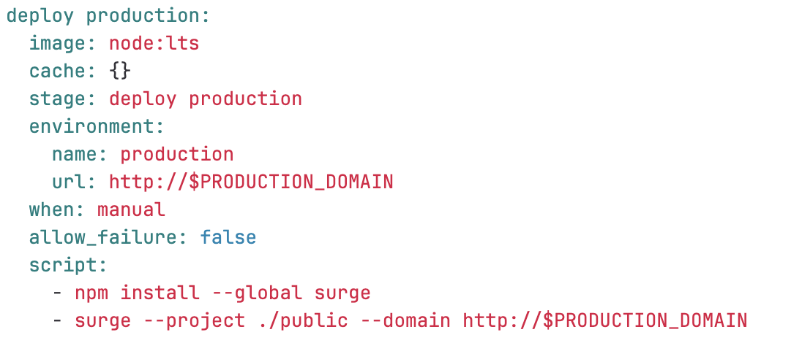
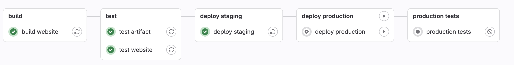

# Static Website Project - Manual Deployments

If we want a manual review process where they look at staging before deploying, not an automatic deployment process.

1. Add a when step to the deploy production job.

2. When you run the pipeline the deploy production job will be stuck and the production tests job will fail.
3. Click the play button on deploy production to manually run it.
4. Then re-run the production tests step so it passes.
5. To stop the production tests job from running before we have manually allowed the deployment, add this line...

