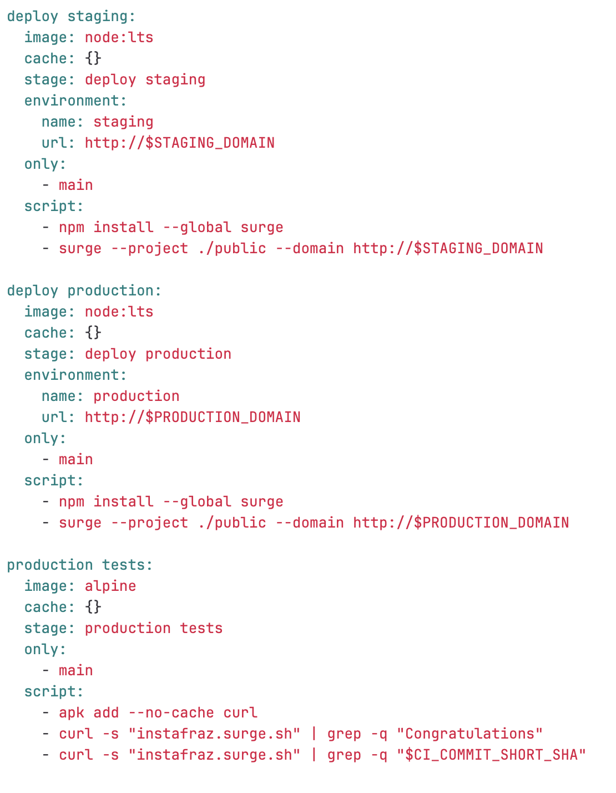
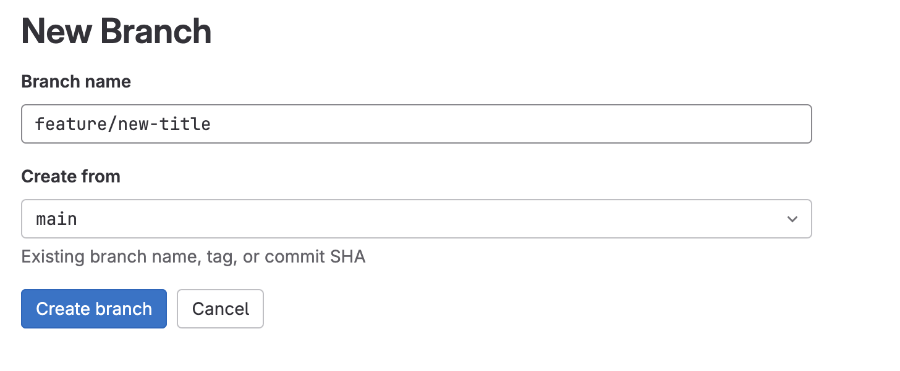
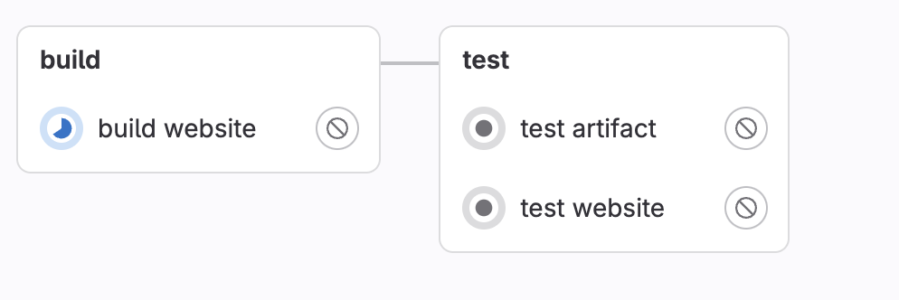
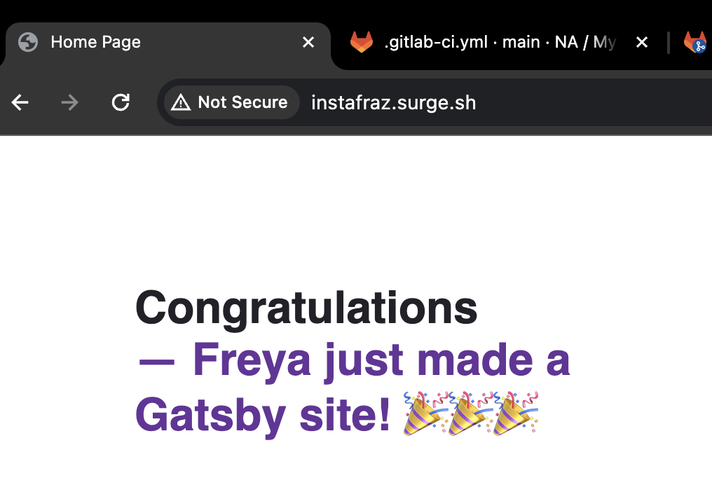

# Merge Requests and Branches

## Branches

- test before merging to the master branch
- Branching statagies e.g. GitFlow
- avoids breaking the master/main branch

In GitLab you can set protections on branche such as not allowing hard pushes or pushes at all from anyone

You can also manage merge request options

# 11. Branches

1. When using a non-main branch we don't want the jobs that deploy to staging or production to run.
2. We can add a command that specifies this for those specific jobs.

3. Create a new branch by going to 'code'
4. 'branches'
5. new branch

6. The pipeline will start automatically and won't include the main-only steps

7. Make a change to the title in index.js
8. Create merge request
   - delete source branch after merge accepted 
9. The website will now have a different title

