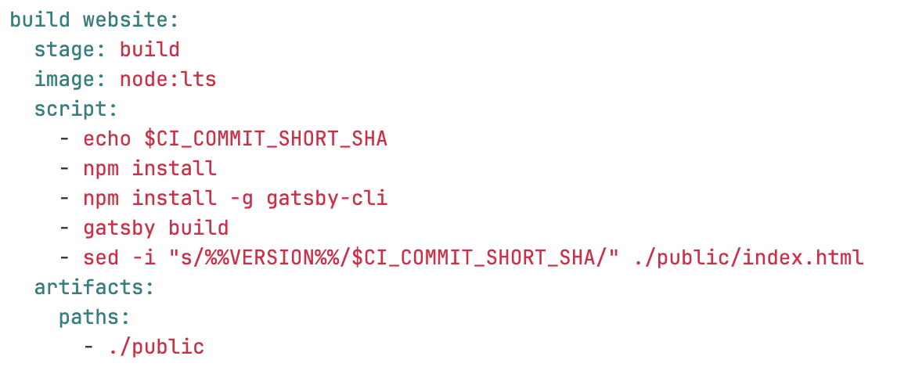
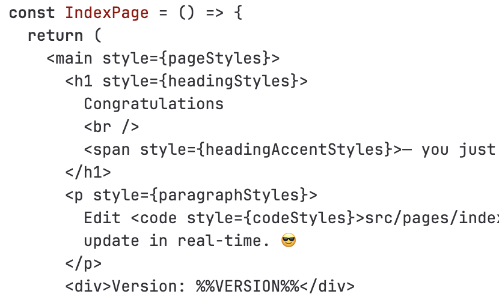
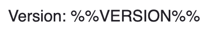
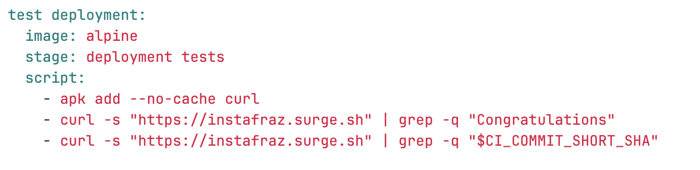

# Static Website Project - Predefined Environment Variables

GitLab comes many predenfined environment variables we can use.

# 6. Adding commit version to the website

1. Add predenfined environment variable to pipeline script in build job
2. Add a sed command to replace marker with the variable in the html file
   - -i to edit in same file not to create a new one 
   - s for substitute

3. Change index.js to include the marker. (index.js becomes the html file)
   

4. Refresh the page and the version will be displayed, but will go back to the marker after a second as it hasn't changed in all the files.

# 7. Testing for for the version

1. Add another curl and search command, but this time search for the variable

