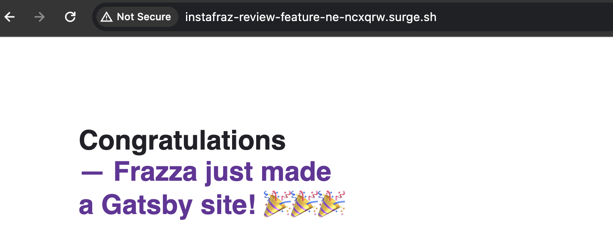

# Static Website Project - Adding a Staging Environment

Environments: allow us to control the CI/CD process and track our deployments

# 9. Staging Environment

1. In the pipeline script add a deploy staging job.
2. Add environment to the deploy staging job.
3. Add environment to the deploy production job.

4. Go to Operate
5. Environments

# 12. Dynamic Environment

A dynamic environment lets each merge reques/branch be deployed to an environment to easily review the changes and run more tests.

1. Add a deploy review stage to the script
2. Add only: merge_requests to the deploy review job

3. Add only: merge_requests and main to the jobs before it
4. Make an edit e.g. to title in the index.js file
5. Make a merge request
6. Then view the merge request pipeline...
   

7. Review the dynamic environment...

8. If happy merge!

# 13. Destroying Environments

After you merge you no longer need the dynamic environment, but how do you destroy it?

1. Add a stop review job to the deploy review stage that allows us to automatically destroy the environment.
2. We want it to run after the branch has been merged and maybe even deleted.
3. Add an on_stop command to the deploy review to link the two jobs.

To test...

1. Create a new branch and merge.
2. View the Merge Pipeline...

6. Manually start the stop review job
7. When stop review has passed the dynamic environment website should look like this...
   
