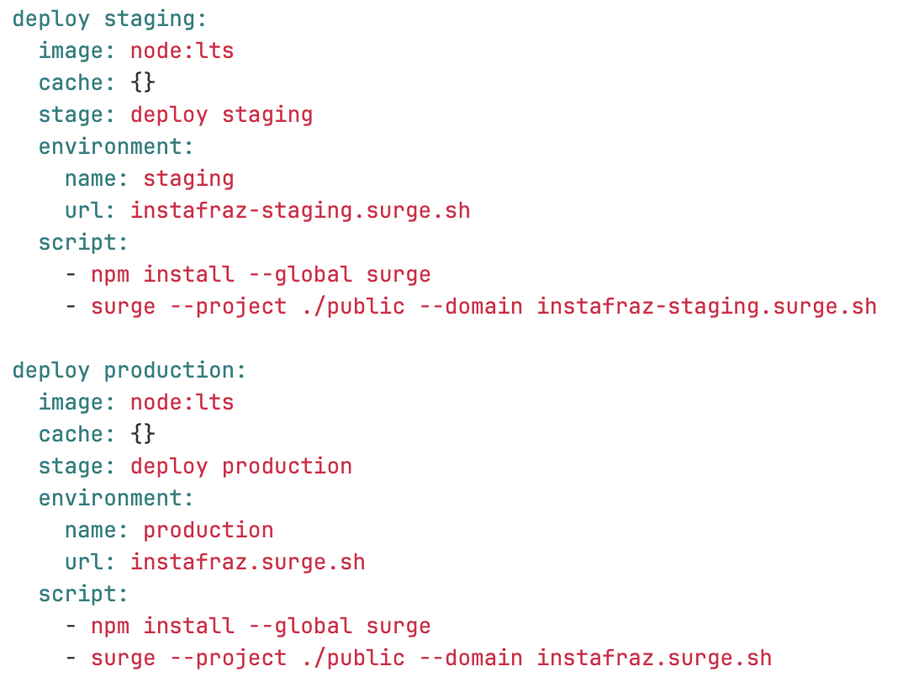

# Static Website Project - Adding a Staging Environment

Environments: allow us to control the CI/CD process and track our deployments

# 9. Staging Environment

1. In the pipeline script add a deploy staging job.
2. Add environment to the deploy staging job.
3. Add environment to the deploy production job.

4. Go to Operate
5. Environments

# 12. Dynamic Environment

A dynamic environment lets each merge reques/branch be deployed to an environment to easily review the changes and run more tests.

1. Add a deploy review stage to the script
2. Make an edit e.g. to title in the index.js file
3. Make a merge request